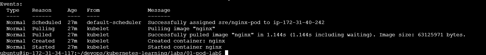

# Pod Lab

## Objective

Deploy a single nginx pod.

## Create Pod

```bash
kubectl apply -f pod.yaml
```

## Verify

```bash
kubectl get pods -n sre
```

## Delete

```bash
kubectl delete -f pod.yaml
```
### Pod Created


### Pod Running


### Scheduler Selected Node


### Pod Events

